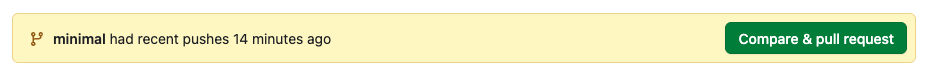

# template-wp

WordPressコーディング用テンプレートリポジトリです。

## ブランチ

使用するブランチをどちらか選んでリポジトリを作成してください。
「Use this template」を使う場合、デフォルトは `main` ブランチが選択されます。`minimal` を使用するときは「Include all branches」を **On** にしてください。

| ブランチ  | 概要                                                                                               |
| --------- | -------------------------------------------------------------------------------------------------- |
| `main`    | フル版。レスポンシブmixin・rem換算・表示制御クラスあり                                             |
| `minimal` | シンプル版。SCSSのベース機能なし、メディアクエリは直書き。独自のSCSS構成にカスタマイズしたい方向け |

```bash
# フル版
git clone git@github.com:eeyan-corp/template-wp.git

# シンプル版
git clone -b minimal git@github.com:eeyan-corp/template-wp.git
```

> ⚠️ リポジトリ作成後に表示される以下のバナーは無視してください。`minimal` を `main` へ**マージしないでください。**
>
> 

---

## ディレクトリ構成

> 緑色の行は `main` ブランチのみ含まれるファイル・ディレクトリ

```diff
 root/
 ├── index.php
 ├── .htaccess
 ├── assets/
 │   ├── css/                           # コンパイル後のCSS（自動生成）
 │   ├── scss/
 │   │   ├── styles.scss
+│   │   ├── base/                      # レスポンシブmixin・リセットCSS
+│   │   │   ├── shortcut-functions.scss # mixin・関数のエクスポート
+│   │   │   ├── index.scss              # 表示制御クラス生成
+│   │   │   └── libs/
+│   │   │       ├── reset.scss          # リセットCSS（destyle.css）
+│   │   │       ├── responsive.scss     # メディアクエリmixin
+│   │   │       └── rem-base-font-size.scss # rem基準フォントサイズ設定
 │   │   └── site/                      # 案件ごとに編集するファイル
+│   │       ├── variables.scss          # ブレイクポイント・基準幅設定
 │   │       ├── common.scss             # 共通スタイル・カスタムプロパティ
+│   │       ├── modules/                # 共通mixin
+│   │       │   └── hover.scss          # ホバー・フォーカスmixin
 │   │       ├── parts/
 │   │       │   ├── header.scss
 │   │       │   └── footer.scss
 │   │       └── pages/
 │   │           └── top.scss
 │   ├── js/
 │   │   └── script.js
 │   └── images/
 │       ├── common/
 │       └── top/
 ├── dev/              # ビルドツール（webpack）
 └── wp/
     └── wp-content/
         ├── themes/
         │   └── base/ # テンプレートテーマ
         └── plugins/
```

---

## セットアップ

1. WP本体を `wp/` に配置・インストール（`wp-content/` はすでに存在するため上書き不要）

   > **【Local Sites の場合】**
   >
   > 1. サイト作成後、`app/public/` 直下のWPファイルを `wp/` を作成し移動。
   > 2. cloneしテンプレートを展開。`wp/wp-content/` はcloneしたテンプレートの `wp-content/` に差し替え。

2. DBの `siteurl` を `http:〇〇〇〇〇〇/wp` に更新。
3. 管理画面 → 外観 → テーマ から `base` を有効化
4. npm パッケージをインストール

```bash
cd dev
npm i
```

---

## 開発時に使えるコマンド一覧

```bash
cd dev
npm run watch      # SCSS監視・自動コンパイル（開発時）
npm run css-minify # CSS minify（本番用）
npm run image-minify # 画像圧縮（JPG/PNG）
npm run webp       # WebP変換
```
